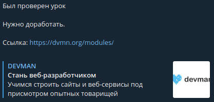

# hw_check

Это python скрипт, который позволяет через long polling получать уведомления о проверках уроков курса [devman](https://dvmn.org/) в отдельном телеграм боте.

## Установка

Требуется [Python](https://www.python.org/downloads/) версии 3.7 или выше и установленный [pip](https://pip.pypa.io/en/stable/getting-started/).

1. Скачайте репозиторий.
2. Установите необходимые зависимости:  
   - Для Unix/macOs:`python -m pip install -r requirements.txt`
   - Для Windows:`py -m pip install --destination-directory DIR -r requirements.txt`
3. В корне репозитория создайте пустой файл `.env`
4. Получите доступ к урокам [devman](https://dvmn.org/modules/). У вас должен появится доступ к [devman api token](https://dvmn.org/api/docs/).
5. В файл `.env` добавить строку `DEVMAN_API_TOKEN=token`, где `token` - полученный на шаге 4 токен от [api devman](https://dvmn.org/api/docs/).
6. Создайте нового телеграмм бота у [BotFather](https://telegram.me/BotFather). По итогу вы должны получить `token` от нового бота.
7. В файл `.env` добавить строку `TELEGRAM_BOT_API_TOKEN=token`, где `token` - полученный на шаге 6 токен от [BotFather](https://telegram.me/BotFather).
8. В файл `.env` добавить строку `TELEGRAM_CHAT_ID=id`, где `id` - ваш "id" в телеграмме.
   - Если не знаете ваш "id", воспользуйтесь специальным [ботом](https://telegram.me/userinfobot).
9. Создайте нового телеграмм бота для логгирования у [BotFather](https://telegram.me/BotFather). По итогу вы должны получить `token` от нового бота.
10. В файл `.env` добавить строку `TELEGRAM_BOT_LOGGER_API_TOKEN=token`, где `token` - полученный на шаге 9 токен от [BotFather](https://telegram.me/BotFather).

## Запуск

Обычный запуск:
1. Запустите файл `hw_check.py` как python скрипт: `python3 hw_check.py`. При обновлении статуса по проверке ваших уроков будут приходить сответствующие сообщения от вашего телеграм бота.

Запск через docker:
1. `docker build -t app_name .` - билд приложения с именем "app_name".
2. `docker run -d --env-file ./.env -it --rm --name my-running-app app_name` - запуск приложения с именем "app_name" и с текущими переменными окружения из файла ".env".

Пример сообщения:  
